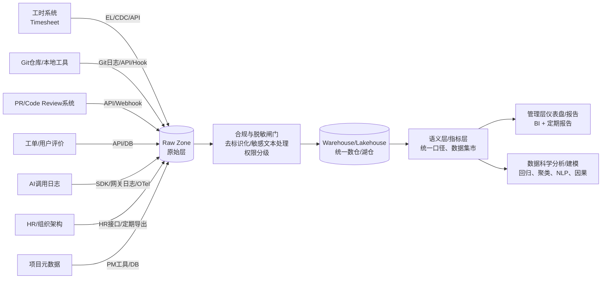

# 员工工时数据挖掘与多源协同分析：面向软件开发公司的管理层分析报告与优化建议

## 执行摘要

本报告聚焦“工时数据 + 代码产出 + 协作流程 + 用户反馈 + AI使用 + 人员属性 + 项目元数据”的多源协同分析，目标是在**不陷入“监控式管理”**的前提下，为管理层提供可落地的洞察：资源投入是否匹配业务优先级、交付瓶颈在哪里、质量与客户满意度受哪些过程因素影响、AI工具的使用是否带来可验证的效率或质量变化，以及如何通过流程与平台治理实现持续改进。

核心结论与建议分为三层：

第一层是“先把数据连起来、把口径统一起来”。没有统一的人员/项目/任务标识、统一的时间粒度与时区、统一的事件定义（例如“工时类型”“PR大小”“合并时间”“用户评分”等），任何高级模型都会产生“看似精确、实则误导”的结果。个人信息保护法明确要求**数据处理目的明确、最小必要、不应过度收集，并应保证数据质量与安全措施**，这意味着数据字典、口径治理与权限审计不是可选项，而是项目能否上线与可持续的前置条件。citeturn0search0

第二层是“用对指标与图表，管理层重点看‘流程与系统’，而不是‘个体排名’”。在软件研发效能领域，DORA指标体系（变更前置时间、部署频率、变更失败率、恢复时间）被广泛用于衡量交付吞吐与稳定性，并强调通过持续改进来提升系统能力。citeturn1search0turn1search7 同时，多方实践与行业讨论反复提醒：把单一指标当作考核目标，会触发“指标被博弈”的反作用（Goodhart定律），并且DORA指标本身也不适合衡量“个体工作量/质量/团队动力”等维度。citeturn8search14turn4search9 因此，本报告的指标设计默认以**团队/项目/阶段**为主视角，用个体维度仅做“辅助手段”（例如识别培训需求、工具可用性问题），并配套伦理与治理机制。

第三层是“从描述到因果：先找瓶颈，再做验证”。建议采用“描述性统计/时间序列/相关性 → 回归与分层模型 → 因果图与格兰杰检验 → 小规模干预试验”的递进路径。格兰杰因果检验可用于检验时间序列上“先发生的变化是否对后续变化具有预测力”，但它不等同于真实因果，需要结合业务机制与因果图假设。citeturn0search7 因果图方法为“把业务假设显式化、检验可识别性、避免把共同原因误当因果”提供结构化语言。citeturn2search3

本报告给出一套面向管理层的“可交付物模板”：数据源与字段清单（含未指定字段标注）、采集与合规评估、分析方法与指标表、可视化清单与示例数据结构、脚本/SQL/伪代码示例、工具选型对比、以及隐私伦理与实施风险缓解方案。

## 数据源与字段规范：跨系统对齐的采集清单与关联设计

本项目建议采用“事实表（事件）+ 维度表（人员/项目/任务/时间）”的方式组织数据，形成**统一分析口径**。维度建模（星型模型）因其查询简单、性能好、易被BI工具理解而常用于数据仓库分析场景。citeturn6search13turn6search5

下表列出需收集的数据源与字段。题目已明确的字段完整列出；若某类字段未在题目中指定，则以“（未指定）”标注，并仅作为“建议补充”而非强制假设。

| 数据源 | 字段（题目指定） | 建议补充字段（均未指定） | 典型主键/关联键设计（建议） |
|---|---|---|---|
| 工时日志（Timesheet/工时系统） | 员工ID、项目ID、任务ID、日期、开始/结束时间、工时、工时类型 | 工时记录ID（未指定）、时区（未指定）、地点/远程标识（未指定）、是否已审批（未指定）、备注文本（未指定） | `timesheet_id`；外键：`employee_id`、`project_id`、`task_id`、`date_key` |
| Git/本地管理工具（代码仓） | 提交数、代码行增删、文件变更、分支、提交时间、作者 | 仓库ID（未指定）、commit_hash（未指定）、作者邮箱/映射ID（未指定）、提交消息（未指定）、提交类型标签（未指定） | 事实表粒度建议到**commit事件**：`commit_hash`；外键：`repo_id`、`employee_id`、`project_id（映射）`、`time_key` |
| PR数据（Code Review） | PR数、评论数、合并时间、审查者、PR大小 | PR ID/URL（未指定）、创建时间（未指定）、关闭原因（未指定）、review状态（未指定）、标签/组件（未指定） | `pr_id`；外键：`repo_id`、`author_employee_id`、`reviewer_employee_id`、`project_id（映射）`、`time_key` |
| 用户评价/工单（Voice of Customer/Support） | 评分、反馈文本、时间、项目ID | 工单ID（未指定）、问题类型（未指定）、严重度（未指定）、解决时长（未指定）、是否回归/重开（未指定）、渠道（未指定） | `ticket_id`；外键：`project_id`、`time_key`（必要时引入`customer_id`维度但需合规） |
| AI使用日志（LLM/助手/IDE插件） | 员工ID、终端ID、token/API key、调用时间、调用次数、请求/响应文本、模型/接口、费用 | 会话ID（未指定）、输入/输出token数（未指定）、调用结果状态码（未指定）、延迟（未指定）、任务/项目绑定（未指定）、脱敏版本（未指定） | `ai_call_id`；外键：`employee_id`、`endpoint_id`、`time_key`；**注意token/API key为高敏信息**（见合规部分） |
| HR/人员属性 | 岗位、经验、团队、在职时间 | 员工姓名（未指定，建议不入仓或去标识化）、绩效等级（未指定，强烈建议不用于本项目）、薪资（未指定） | 维度表 `dim_employee(employee_id, role, exp, team, tenure, ...)` |
| 项目元数据（PMO/项目管理） | 项目类型、优先级、客户、里程碑 | 项目状态（未指定）、预算（未指定）、计划/实际日期（未指定）、SLA（未指定） | 维度表 `dim_project(project_id, type, priority, customer, milestone, ...)` |

为了实现“多源协同”，最关键的工程点是**跨系统身份与对象对齐**：

1) **人员身份对齐**：Git作者字段可能是用户名/邮箱；AI日志是员工ID；工时是员工ID。需要维护`employee_identity_map`（例如邮箱→员工ID、Git账号→员工ID），并设定“同名不同人/一人多账号”的冲突处理规则（均为治理策略，不应由模型隐式猜测）。

2) **项目/任务对齐**：Git/PR天然以仓库为中心，工时以项目/任务为中心。建议通过“仓库→项目”的映射表、以及“分支命名/PR标题/commit message中的任务号”规则来增强自动匹配；无法自动匹配的部分要可标记为“未绑定/未知”，避免强行归因。

3) **时间对齐**：统一时区与日历口径（工作日/节假日、迭代周）。否则“开始/结束时间”“合并时间”“调用时间”无法可靠地做序列分析。

建议用下图表达“数据如何汇合、在何处做合规与脱敏闸门”：



## 技术可行性评估与架构建议：采集、合规、质量、存储计算、权限审计

本节从“能不能做、怎么做得稳、怎么做得合规”评估技术路线，并给出架构建议。

**数据采集可行性：日志 + API + 数据库 + Git Hooks**

- Git侧数据获取成熟：可通过`git log`离线抽取、或通过平台API（GitHub/GitLab）获取PR、review、comment等结构化数据。Git Hooks可在特定事件触发脚本，适合补充采集“推送/合并”事件或强制提交规范（例如必须带任务ID）。Git官方文档明确列出了多种hooks及触发时机（如`pre-receive/update/post-receive`等）。citeturn3search1turn3search5  
- PR侧建议优先走平台API：例如GitHub提供“Pull request reviews / review comments”等REST API端点，能够获取审查记录与评论。citeturn3search2turn3search14  
- AI调用日志建议标准化：若公司内部有统一网关或SDK，建议接入OpenTelemetry（OTel）作为统一遥测标准，便于采集调用时间、次数、错误率、延迟与费用等并与其他系统打通。OTel定位为“供应商中立、开源的可观测框架”，覆盖traces/metrics/logs。citeturn3search3turn3search15  

**隐私与合规：必须建立“目的限定 + 最小必要 + 透明告知 + 去标识化/匿名化 + 审计”闭环**

在中国法域下，个人信息保护法对个人信息处理提出了**合法正当必要、目的明确且与目的直接相关、最小范围收集、公开透明、保证数据质量、采取安全措施**等原则。citeturn0search0 对本项目意味着：

- **目的限定**：要在制度与告知中写清楚“用于提升研发流程与项目管理能力、保障交付质量与客户体验”，避免滑向“个体绩效自动化决策”。  
- **最小必要**：AI调用日志中的“请求/响应文本”风险极高（可能包含客户信息、源代码、账号密钥、个人信息）。应当以“能回答管理问题”为边界，优先存**结构化元数据与派生特征**（例如token数、主题标签、是否含敏感实体、费用、延迟），原文仅在严格必要且有权限控制、脱敏后才保留。个人信息保护法也给出了“去标识化/匿名化”的定义，可作为处理策略依据。citeturn0search0  
- **自动化决策约束**：法律要求自动化决策应保证透明与结果公平公正，并对重大影响决定提供解释与拒绝权利。citeturn0search0 因此任何“基于模型的个人评分/排名/奖惩”都属于高风险用途，应在治理层面明确禁止或需单独评估。  
- **合规审计与影响评估**：法律要求“定期合规审计”，并在处理敏感个人信息、自动化决策等情形进行个人信息保护影响评估并留存记录。citeturn0search0  

**token共享风险与敏感文本脱敏：两类“高概率事故点”**

- token/API key应视为密码级机密。GitHub文档直接提示“Treat your access tokens like passwords（将访问令牌视为密码）”。citeturn3search0 因此AI日志“token/API key”字段虽然题目要求采集，但强烈建议在数仓层面改为：只保存`token_id_hash`、`key_scope`、`rotation_time`等派生字段，原始key不落盘或进入专用密钥管理系统。  
- 敏感文本脱敏建议采用“双层策略”：第一层规则脱敏（密钥格式、手机号邮箱、身份证号、客户域名等）；第二层模型/NER脱敏（人名、地名、组织名、代码片段中的凭据）。并将“脱敏前原文”的访问权限控制在极小范围，且默认不进入BI层。

**数据质量问题：多源协同的“最大工程成本”通常不在模型，而在口径与缺失**

个人信息保护法明确要求保证个人信息质量，避免因不准确不完整造成不利影响。citeturn0search0 本项目常见质量风险包括：

- 工时：忘记填报、跨日工时、会议/沟通被混填为开发、开始结束时间缺失。  
- Git：一人多账号、合并提交/自动化提交混入、代码行增删对不同语言/自动格式化敏感（不宜直接当“产出”）。  
- PR：PR大小口径不统一（按文件数/改动行数/变更点）、合并时间缺失（关闭未合并）、评论机器人噪声。  
- 工单/反馈：评分极不均衡、文本短且口语化、同一问题多次反馈去重难。  
- AI日志：请求/响应文本与业务、代码强相关，含敏感信息概率高；不同终端/插件上报格式不同。

建议引入“数据质量闸门”：在ELT阶段生成`dq_score`（完整性、唯一性、时序合理性、关联键命中率），并在仪表盘旁显式展示“本期数据覆盖率”，避免管理层在低覆盖率情况下误读结论。

**存储与计算架构建议：数仓/湖仓 + 时序/日志系统 + ELT为主，辅以可追溯审计**

- 指标分析主平台建议采用数仓或湖仓（Lakehouse）。湖仓的常见实现会在对象存储+表格式上提供类似数据库的可靠性。以Delta Lake为例，官方说明其通过基于文件的事务日志扩展Parquet，提供ACID事务与可扩展元数据处理能力。citeturn6search2turn6search6 以Apache Iceberg为例，其定位为“大型分析数据集的开放表格式”，可被Spark/Trino/Flink等引擎像SQL表一样查询。citeturn6search3turn6search11  
- ELT/ETL建议：优先ELT，把原始数据先落地到Raw层，再在仓内做转换；dbt等工具强调“转换是ELT中的T，发生在数据加载进仓库之后”。citeturn6search0 这与“可审计、可重跑、可回溯”目标一致。  
- AI调用与可观测日志：若数据量极大且需要按分钟/秒级分析，可并行落入日志/时序系统（用于排障与成本监控），再抽取聚合到数仓用于管理分析。OTel的统一遥测思路可减少多套采集体系。citeturn3search3  

**权限与审计：最小权限、分级访问、可追踪访问记录**

- 建议按数据敏感度分层：L0（公开指标聚合）、L1（团队级明细）、L2（含文本但已脱敏）、L3（极少数可访问的原文/密钥相关）。  
- 最小权限原则可参考NIST SP 800-53中“AC-6 Least Privilege（仅授予完成任务所需的授权访问）”。citeturn7search0turn7search4  
- API安全与审计建议参考OWASP API Security Top 10（2023版）用于约束“过度数据暴露、鉴权缺陷、资源消耗失控、日志监控不足”等风险类别。citeturn7search2turn7search6  

## 分析方法与指标体系：从描述到因果、从结构化到文本

本项目的分析对象具有明显层级结构（员工属于团队、团队做项目、项目包含任务、随时间演进），且存在多源异步事件（commit/PR/工单/AI调用）。因此方法选择应以“能解释、可行动、可审计”为第一原则，而非追求复杂模型。

下表汇总题目要求的方法，给出适用场景、输入字段、输出指标与可解释性注意点（管理层阅读重点在“输出指标与注意点”）。

| 方法 | 适用场景（管理问题） | 典型输入字段（来自哪些源） | 输出指标/结论形式 | 可解释性与注意点 |
|---|---|---|---|---|
| 描述性统计 | 当前投入结构是什么？会议/开发/支持占比？高优项目是否得到足够工时？ | 工时日志（工时、类型、日期）、HR（团队）、项目元数据（优先级） | 占比、均值/分位数、TopN项目投入、WIP（并行项目数） | 对“缺失填报”高度敏感；需与数据覆盖率一起展示（合规上也要求数据质量）。citeturn0search0 |
| 时间序列分析 | 交付节奏是否稳定？迭代中资源是否被频繁打断？AI使用是否有阶段性变化？ | 工时按日/周聚合、PR/合并时间序列、AI调用次数/费用序列 | 趋势、季节性、峰值/异常周、滚动均值 | 时间口径（时区、周起始）必须统一；事件定义要固定，否则趋势不可比。 |
| 相关性矩阵 | 变量之间是否“同向变化”？如PR等待时间与工时切换频率是否相关？ | 日/周级聚合：工时结构、PR指标、工单指标、AI使用指标 | 相关性热图、显著性 | 相关≠因果；可辅助筛选候选因素进入回归/因果分析。 |
| 皮尔逊相关 | 线性相关假设较合理时（如费用与调用次数） | 数值型聚合指标 | Pearson r | 对异常值敏感，且只刻画线性关系。 |
| 斯皮尔曼相关 | 存在非线性但单调关系，或分布偏态（如PR大小与审查时长） | 数值或有序指标 | Spearman ρ | Spearman相关基于秩，经典来源可追溯到Spearman对“关联测度”的研究。citeturn2search1 |
| 格兰杰因果检验 | 时间序列上“X的过去是否有助于预测Y的未来？”例如：AI调用增多是否先于缺陷率下降/上升 | 周级序列：AI调用、PR返工率、工单缺陷、交付指标 | Granger显著性、滞后阶 | Granger因果是“预测因果”定义，不保证真实因果，需要结合机制与控制变量。citeturn0search7 |
| 线性/多元回归 | 在控制混杂因素后，估计“某因素变化1单位，结果变量期望变化多少” | 结果：交付前置时间/缺陷/评分；自变量：工时结构、PR指标、AI使用、项目属性、团队属性 | 回归系数、置信区间、解释度 | 强依赖变量选择与混杂控制；要避免把“代码行增删”当作生产力直接指标（激励扭曲风险）。可借Goodhart定律提醒。citeturn8search14 |
| 混合效应/分层模型 | 数据存在层级：个人/团队/项目/时间；或需要控制“个体固定差异” | 同上，并加入随机效应（员工/项目） | 固定效应解释 + 随机效应方差分解 | 经典混合模型框架用于处理重复测量与个体差异。citeturn2search2 |
| 聚类（员工/任务/项目） | 识别项目类型/团队工作方式的“群体模式”：高支持型、平台型、交付型等 | 聚合特征：工时类型向量、PR周期、缺陷率、AI使用结构 | 簇标签、簇画像、典型案例 | 聚类用于“画像与讨论”，不宜用于绩效排名；簇数选择需可解释。 |
| 主题建模（NLP） | 用户反馈/工单文本主要在抱怨什么？PR评论在讨论哪些模块/风险？ | 反馈文本、PR评论文本（建议脱敏后）、时间、项目ID | 主题-关键词、主题随时间变化 | LDA是经典主题模型：把文档表示为主题混合、主题表示为词分布。citeturn2search0 |
| 情感分析 | 用户反馈情绪走势、重大版本发布前后情绪变化；内部PR讨论温度（谨慎） | 反馈文本、PR评论文本、时间、项目 | 情感得分、正负面比例、情绪峰值 | 规则/词典法如VADER对社交文本设计；中文需本地化词典与领域微调。citeturn5search2 |
| 异常检测 | 识别异常周：工时暴涨+缺陷暴涨、PR堆积、AI费用异常 | 多维时间序列特征、事件流 | 异常分数、异常点列表、根因候选 | Isolation Forest利用“异常更易被隔离”的思想；LOF基于局部密度衡量离群程度。citeturn5search0turn5search1 |
| 因子分析/降维 | 指标太多时提取少数“潜在维度”：例如“协作摩擦”“交付压力”等 | 多指标矩阵（项目/团队为样本） | 因子载荷、因子得分、解释方差 | 因子分析用较少潜变量解释多观测变量的协方差结构。citeturn9search0turn9search4 |
| 贝叶斯网络/因果图 | 把业务机制显式化：工时结构→PR周期→缺陷→评分；并讨论干预点 | 多源指标 + 专家知识（边的方向假设） | DAG结构、条件依赖、干预推断（可选） | 因果图用于识别“哪些关系在假设下可辨识”；Pearl提出的因果图框架强调用图整合统计与领域知识。citeturn2search3 |

**指标体系建议：以“交付吞吐与稳定性 + 协作效率 + 质量与客户体验 + 成本与风险”四象限组织**

- 交付吞吐与稳定性：建议引入DORA指标口径（变更前置时间、部署频率、变更失败率、恢复时间），作为管理层统一语言。citeturn1search0turn1search7  
- 协作效率：PR等待时间、review轮次、评论密度、审查者参与度等。研究显示现代代码评审的覆盖率、参与度、专业度与软件质量（如缺陷）存在显著关联，可将其作为“质量领先指标”。citeturn8search2  
- 质量与客户体验：工单缺陷率、重开率（若后续补采）、用户评分与情感走势。  
- 成本与风险：AI调用成本、异常费用、token泄露风险、敏感文本暴露风险（需脱敏检测）。

**重要治理提醒：指标用于改进，不用于个体问责**

- DORA指标能展示交付系统性能，但不应被用来衡量客户满意度、团队动力或个体工作量/质量等。citeturn4search9  
- 好的度量系统要防止“当指标成为目标，就不再是好指标”的激励扭曲。citeturn8search14  

## 可视化清单与示例数据结构：图表怎么做、需要什么数据

本节列出题目要求的科研/管理图表，并给出制作说明与示例数据结构。示例数据为模拟小规模样例，便于理解字段与绘图口径；真实落地应从数仓语义层导出。

### 示例模拟数据（用于多图复用）

**示例聚合表：按“员工-项目-日期”日粒度汇总（daily_employee_project）**

| date | employee_id | project_id | hours_total | hours_dev | hours_meeting | commits | loc_add | loc_del | prs_merged | pr_review_comments | ai_calls | ai_cost_usd | ticket_score_avg |
|---|---|---:|---:|---:|---:|---:|---:|---:|---:|---:|---:|---:|---:|
| 2026-03-16 | E01 | P01 | 8.0 | 5.5 | 2.0 | 3 | 220 | 80 | 1 | 6 | 12 | 3.40 | 4.6 |
| 2026-03-16 | E02 | P01 | 7.5 | 4.0 | 3.0 | 2 | 140 | 60 | 0 | 2 | 5 | 1.10 | 4.6 |
| 2026-03-16 | E03 | P02 | 8.5 | 6.5 | 1.0 | 4 | 310 | 120 | 1 | 10 | 18 | 4.80 | 3.9 |
| 2026-03-17 | E01 | P01 | 8.0 | 6.0 | 1.5 | 4 | 260 | 90 | 1 | 4 | 9 | 2.70 | 4.4 |
| 2026-03-17 | E02 | P01 | 8.0 | 4.5 | 2.5 | 1 | 60 | 40 | 0 | 1 | 3 | 0.60 | 4.4 |
| 2026-03-17 | E03 | P02 | 7.0 | 5.0 | 1.5 | 3 | 180 | 110 | 1 | 7 | 20 | 5.20 | 3.7 |

**示例工时流向边表（用于Sankey）：hours_flow_edges**

| source | target | value_hours |
|---|---|---:|
| E01 | P01 | 16.0 |
| E02 | P01 | 15.5 |
| E03 | P02 | 15.5 |
| P01 | Dev | 14.0 |
| P01 | Meeting | 9.0 |
| P02 | Dev | 11.5 |
| P02 | Meeting | 2.5 |

**示例AI热力图矩阵（用于“小时×员工”）：ai_calls_by_hour**

| employee_id | hour_of_day | ai_calls |
|---|---:|---:|
| E01 | 10 | 3 |
| E01 | 14 | 5 |
| E01 | 16 | 4 |
| E02 | 11 | 2 |
| E02 | 15 | 3 |
| E03 | 9 | 4 |
| E03 | 13 | 6 |

**示例文本表（用于主题建模/词云/情感）：feedback_text**

| time | project_id | score | text |
|---|---|---:|---|
| 2026-03-16 09:10 | P01 | 5 | “新版本加载速度明显快了，操作更顺。” |
| 2026-03-16 15:40 | P02 | 3 | “偶尔会卡顿，报表导出失败，希望修复。” |
| 2026-03-17 11:05 | P02 | 2 | “权限设置太复杂，找不到入口。” |
| 2026-03-17 18:20 | P01 | 4 | “功能不错，但还有小bug。” |

### 图表清单：制作说明与数据结构要点

相关性热图（Correlation Heatmap）用于回答“哪些指标一起变化”，数据结构是“样本×指标”的宽表（如daily_employee_project选择数值列），计算相关系数矩阵后绘制。注意：应同时输出样本量与显著性，避免在样本很小或缺失严重时误读；并明确相关≠因果。Spearman相关可在偏态数据与非线性单调关系下更稳健。citeturn2search1

散点图带回归线用于回答“一个变量变化是否伴随另一个变量变化”，例如`hours_dev` vs `prs_merged`或`ai_calls` vs `loc_add`；数据结构为两列数值+可选分组（team/project）。建议在图中标注回归斜率、置信区间与异常点；并在旁注声明：这是统计关联而非个体绩效证明。结合Goodhart定律，避免把回归斜率直接映射为“多写代码就更好”。citeturn8search14

时间序列堆叠图（Stacked Area/Bar）用于展示工时类型结构随时间变化，如每天`hours_dev/hours_meeting/...`堆叠；数据结构为“日期×工时类型×值”。该图对“工时类型定义一致性”高度敏感，必须先统一字典。

员工/项目对比条形图用于管理层资源配置决策，例如按项目优先级展示“投入工时/交付数/缺陷数/评分”。数据结构为“项目×指标”的聚合表，建议同时展示“项目优先级/里程碑”，避免脱离业务语境。

Sankey/流向图（工时流向）用于回答“工时从哪里流向哪里”（员工→项目→工时类型/活动类型），数据结构为边列表（source,target,value）。适合做组织协作与资源分配的“宏观图”，不建议下钻到个人日常细节以免形成监控感。

PR与工时的双轴图用于回答“评审堆积是否与投入结构变化同步”，例如左轴`prs_merged/pr_wait_time`，右轴`hours_meeting`。数据结构为周粒度时间序列。注意双轴图容易误导，必须明确每轴单位，并优先用“标准化/指数化”展示趋势而非绝对值。

AI使用热力图用于回答“AI使用集中在哪些时段/哪些团队”，数据结构为“员工/团队×小时/日期×调用次数/费用”。若要合规，建议热力图在BI层默认聚合到团队/项目级，个人层需授权且目的明确。个人信息处理应遵循最小必要与透明原则。citeturn0search0

主题词云用于“快速展示主题关键词”，数据结构为脱敏后的文本集合（按项目/版本切片）。词云适合传播但解释力弱，建议同时提供主题模型输出（主题-关键词-占比随时间变化），例如LDA。citeturn2search0

因果关系示意图用于把管理层假设表达清楚，例如“会议占比→PR等待时间→缺陷→评分”。推荐用mermaid绘制，并在图中标注可观测变量与潜在混杂（如项目复杂度）。因果图方法强调用图整合统计与领域知识，并判断在给定假设下因果效应是否可识别。citeturn2search3

示例因果图（仅示意）：

```mermaid
flowchart LR
  X1[会议工时占比] --> Y1[PR等待/合并周期]
  X2[PR大小] --> Y1
  C1[项目复杂度(潜在/代理)] --> X2
  C1 --> Y1
  Y1 --> Q1[缺陷/返工率]
  Q1 --> CSAT[用户评分/情绪]
  A1[AI使用强度] --> Y1
  A1 --> Q1
```

## 分析流程与交付物：脚本、SQL、模型训练验证、报告结构与工具对比

本项目建议按“可落地交付物”组织工作，而不是按“模型清单”组织。交付物分为：数据准备、指标层、可视化与报告、以及建模与验证四类。

**数据准备脚本示例（伪代码，强调口径与治理）**

```python
# 伪代码：统一抽取 -> 去标识化/脱敏 -> 落地Raw -> ELT转换到数仓

def extract_timesheet(db_conn, start_date, end_date):
    rows = db_conn.query("""
      SELECT employee_id, project_id, task_id, date,
             start_time, end_time, hours, hour_type
      FROM timesheet
      WHERE date BETWEEN :start AND :end
    """, params={"start": start_date, "end": end_date})
    return rows

def extract_github_pr(api, repo, since):
    # GitHub PR reviews API（真实实现需分页、限流、鉴权）
    # 参考官方PR reviews & comments端点定义
    # https://api.github.com/repos/{owner}/{repo}/pulls/{pull_number}/reviews
    return api.get_pr_reviews(repo=repo, since=since)

def deidentify_and_redact_text(text):
    # 第一层：规则脱敏（密钥/邮箱/手机号/身份证等）
    # 第二层：NER/模型脱敏（人名/组织/客户名）
    # 输出：redacted_text + detected_sensitive_tags
    return redacted_text, tags

def write_raw(zone_path, dataset_name, rows):
    # 写入Parquet/JSON，并生成元数据（抽取时间、版本、行数、dq_score）
    pass

def elt_transform_in_warehouse(dbt_project):
    # dbt作为ELT的“仓内转换(T)”
    # 官方说明：Transformation是ELT中的T，发生在raw数据加载到仓库之后
    pass
```

dbt“仓内转换（ELT中的T）”的理念可作为治理基线：Raw层可追溯、转换层可测试、指标层可复用。citeturn6search0

**关键SQL/分析伪代码示例**

1) 构建日粒度聚合（示意）：

```sql
-- daily_employee_project：用于相关/回归/看板的统一口径表
CREATE VIEW mart.daily_employee_project AS
SELECT
  d.date,
  ts.employee_id,
  ts.project_id,
  SUM(ts.hours) AS hours_total,
  SUM(CASE WHEN ts.hour_type='dev' THEN ts.hours ELSE 0 END) AS hours_dev,
  SUM(CASE WHEN ts.hour_type='meeting' THEN ts.hours ELSE 0 END) AS hours_meeting,
  COALESCE(gc.commits, 0) AS commits,
  COALESCE(gc.loc_add, 0) AS loc_add,
  COALESCE(gc.loc_del, 0) AS loc_del,
  COALESCE(pr.prs_merged, 0) AS prs_merged,
  COALESCE(pr.review_comments, 0) AS pr_review_comments,
  COALESCE(ai.ai_calls, 0) AS ai_calls,
  COALESCE(ai.ai_cost_usd, 0) AS ai_cost_usd,
  COALESCE(tk.ticket_score_avg, NULL) AS ticket_score_avg
FROM dim_date d
LEFT JOIN fact_timesheet ts ON ts.date = d.date
LEFT JOIN agg_git_daily gc  ON gc.date = d.date AND gc.employee_id = ts.employee_id AND gc.project_id = ts.project_id
LEFT JOIN agg_pr_daily  pr  ON pr.date = d.date AND pr.employee_id = ts.employee_id AND pr.project_id = ts.project_id
LEFT JOIN agg_ai_daily  ai  ON ai.date = d.date AND ai.employee_id = ts.employee_id AND ai.project_id = ts.project_id
LEFT JOIN agg_ticket_daily tk ON tk.date = d.date AND tk.project_id = ts.project_id;
```

2) PR周期与评审参与度指标（示意，强调质量领先指标）：研究指出评审覆盖、参与与专业度与质量相关，可将其作为重点指标，经由回归控制项目差异后再解释。citeturn8search2

```sql
SELECT
  project_id,
  DATE_TRUNC('week', pr_created_time) AS week,
  COUNT(*) AS pr_count,
  AVG(TIMESTAMPDIFF('hour', pr_created_time, merged_time)) AS pr_cycle_hours,
  AVG(review_comment_count) AS avg_review_comments,
  AVG(unique_reviewer_count) AS avg_reviewer_participation
FROM fact_pr
WHERE merged_time IS NOT NULL
GROUP BY 1,2;
```

**模型训练与验证步骤（建议标准）**

- 数据划分：时间序列优先用“滚动窗口验证”（train在过去，test在未来），避免信息泄露。  
- 基线模型：先做可解释基线（线性/多元回归、分层模型），再考虑非线性。分层/混合效应模型适用于重复测量与个体差异场景。citeturn2search2  
- 因果分析：先画因果图明确假设，再决定能否识别；必要时结合格兰杰检验做“方向性线索”，但不替代因果识别。citeturn2search3turn0search7  
- NLP：主题模型可用LDA作为可解释起点；情感分析可先用规则/词典并做人工抽样校准（中文需本地化）。citeturn2search0turn5search2  
- 异常检测：Isolation Forest/LOF用于“找异常周/异常项目”，输出异常点后必须做人工复盘，避免把正常业务峰值误判为异常。citeturn5search0turn5search1  

**面向管理层的报告结构（模板）**

- 执行摘要：本期最重要的3个发现、2个风险、3项优先行动、预期影响量化口径。  
- 关键发现：按“交付吞吐与稳定性/协作效率/质量与客户体验/成本与风险”四象限组织。DORA指标可作为吞吐与稳定性主干指标。citeturn1search0  
- 证据图表：每个结论必须配一张主图 + 一段解释（口径、样本量、局限）。  
- 优化建议：按“流程、工具平台、组织协作、治理与合规”分类，每条建议有Owner、周期、成本、预期收益计算方式。  
- 实施优先级：用“影响×投入”矩阵排序，并标注依赖项（例如先做身份映射与脱敏）。  
- 附录：数据字典、SQL口径、质量报告、权限与审计记录摘要。

**不同方法/工具优缺点对比（题目要求）**

| 方案/工具 | 优点 | 局限 | 适用阶段建议 |
|---|---|---|---|
| Pandas + Matplotlib | 灵活、快速验证、适合小中数据；可做自定义统计与科研绘图 | 对超大数据与多人协作需要工程化；权限与审计需系统支持 | PoC/方法验证/小规模试点 |
| Spark + MLlib | 适合大规模数据与分布式处理；可统一批处理与部分ML流程 | 成本与运维复杂；对管理层可视化要接BI或输出到数仓 | 数据量大、需要统一离线计算时 |
| Power BI | 与微软生态集成强；适合管理层自助分析；权限体系成熟 | 复杂NLP/因果需外部计算；语义层治理要求高 | 指标看板与管理层报表主力 |
| Tableau | 可视化表达力强，交互分析友好 | 许可证成本、治理与语义层同样关键 | 高交互探索、跨部门可视化传播 |
| Looker | 强语义层（LookML）与指标治理；适合组织规模化指标管理 | 建模学习成本；需要较成熟数据仓库基础 | 指标体系稳定后做长期治理 |

## 隐私伦理与实施风险：高敏数据治理、文化风险、误用风险与缓解

“员工工时数据挖掘”天然触碰隐私与劳动关系敏感区。合规不仅是法律问题，也是组织信任与文化问题。建议把风险分为“法律合规风险、信息安全风险、管理误用风险、组织文化风险”四类，并建立对应缓解措施。

**法律与合规风险**

- 风险：目的不清、过度收集（尤其是AI请求/响应原文）、缺乏透明告知、未经评估的自动化决策。  
- 缓解：对照个人信息保护法建立制度：目的明确、最小必要、公开透明、保证质量与安全；对敏感个人信息、自动化决策开展影响评估并留存记录；必要时以“去标识化/匿名化”降低识别风险。citeturn0search0  
- 特别提示：法律对自动化决策提出透明与公平要求，并赋予个人拒绝仅通过自动化决策作出重大影响决定的权利。citeturn0search0  

**信息安全风险（token/API key与API安全）**

- 风险：token泄露导致代码仓/AI平台被滥用；日志聚合后成为“高价值攻击目标”。  
- 缓解：token按密码级管理；GitHub明确提示访问令牌应像密码一样保护。citeturn3search0 采用密钥管理系统、最小权限、定期轮换；对日志系统做分级访问与审计。参考OWASP API Security Top 10建立防护清单（鉴权、数据暴露、限流、监控）。citeturn7search2  

**管理误用风险（把指标当KPI、个体排名、短期优化伤害长期质量）**

- 风险：将“代码行增删/提交数/AI调用次数”当作个人绩效；形成“刷指标”与内卷；损害代码质量与协作。  
- 缓解：明确指标用于改进而非问责；用Goodhart定律作为制度提醒（当指标成为目标就失效）。citeturn8search14 DORA指标也不应被用于衡量个体工作量/质量或团队动力等。citeturn4search9  

**组织文化风险（监控感、信任下降、信息不愿记录）**

- 风险：员工担心被“量化监控”，导致工时/PR评论/AI使用记录反而失真（数据质量下降），形成反向激励。  
- 缓解：把分析对象定位为“流程与系统”，默认公开团队级汇总；个体层仅在合规授权下用于“支持与赋能”（例如培训、工具改进），并提供可解释说明、纠错机制与申诉入口；对管理层进行“指标伦理”培训，防止误读。

**实施落地的优先级建议（不依赖额外数据即可启动）**

- 最高优先：数据字典与口径治理、身份映射、脱敏与分级权限、数据质量闸门（否则后续分析可信度不足）。  
- 中优先：管理层看板（DORA+协作+质量+成本），用稳定指标建立共同语言。citeturn1search0  
- 次优先：回归/分层模型、主题建模、异常检测，形成“每月复盘机制”。  
- 最后：因果图与准实验/试验，把“建议”变成“可验证的改进闭环”。citeturn2search3